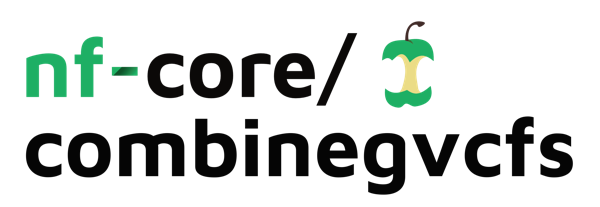

<h1>
  <picture>
    <source media="(prefers-color-scheme: dark)" srcset="docs/images/nf-core-combinegvcfs_logo_dark.png">
    
  </picture>
</h1>

[](https://github.com/nf-core/combinegvcfs/actions/workflows/ci.yml)
[](https://github.com/nf-core/combinegvcfs/actions/workflows/linting.yml)[](https://nf-co.re/combinegvcfs/results)[](https://doi.org/10.5281/zenodo.XXXXXXX)
[](https://www.nf-test.com)

[](https://www.nextflow.io/)
[](https://docs.conda.io/en/latest/)
[](https://www.docker.com/)
[](https://sylabs.io/docs/)
[](https://cloud.seqera.io/launch?pipeline=https://github.com/nf-core/combinegvcfs)

[](https://nfcore.slack.com/channels/combinegvcfs)[](https://twitter.com/nf_core)[](https://mstdn.science/@nf_core)[](https://www.youtube.com/c/nf-core)

## Introduction

**nf-core/combinegvcfs** is a bioinformatics pipeline that takes a set of GVCF files and consolidates them in a single multi-sample VCF file.


## Usage

> [!NOTE]
> If you are new to Nextflow and nf-core, please refer to [this page](https://nf-co.re/docs/usage/installation) on how to set-up Nextflow. Make sure to [test your setup](https://nf-co.re/docs/usage/introduction#how-to-run-a-pipeline) with `-profile test` before running the workflow on actual data.

## Introduction

This workflow will consolidate a set of GVCF files using GLNexus. The workflow will perform the consolidation chromosome-by-chromosome, pooling the small contigs (below `--chunk_size`), minimizing the number of processes and their run times.
The GLNexus configuration can be specified with `--glnexus_config`. If a user needs to provide a custom configuration file, they can do so using the options `--glnexus_config custom --glnexus_config_file <PATH/TO/INPUT/CONFIG.yml>`.

## Samplesheet input

You will need to create a samplesheet with information about the samples you would like to analyse before running the pipeline. Use this parameter to specify its location. It has to be a comma-separated file with 3 columns, and a header row as shown in the examples below.

```bash
--input '[path to samplesheet file]'
```

The `sample` identifiers have to be unique, i.e. one sample per line. The file should have exactly three columns, specifying the sample name and the path to the respective GVCF and TBI files:

```csv title="samplesheet.csv"
sample,gvcf,tbi
SAMPLE1,AEG588A1_S1_L002_R1_001.g.vcf.gz,AEG588A1_S1_L002_R2_001.g.vcf.gz.tbi
SAMPLE2,AEG588A1_S1_L003_R1_001.g.vcf.gz,AEG588A1_S1_L003_R2_001.g.vcf.gz.tbi
SAMPLE3,AEG588A1_S1_L004_R1_001.g.vcf.gz,AEG588A1_S1_L004_R2_001.g.vcf.gz.tbi
```

An [example samplesheet](../assets/samplesheet.csv) has been provided with the pipeline.

## Running the pipeline

The typical command for running the pipeline is as follows:

```bash
nextflow run nf-core/combinegvcfs --input ./samplesheet.csv --outdir ./results --fasta GRCh37.fa -profile docker
```

This will launch the pipeline with the `docker` configuration profile. See below for more information about profiles.

Note that the pipeline will create the following files in your working directory:

```bash
work                # Directory containing the nextflow working files
<OUTDIR>            # Finished results in specified location (defined with --outdir)
.nextflow_log       # Log file from Nextflow
# Other nextflow hidden files, eg. history of pipeline runs and old logs.
```

If you wish to repeatedly use the same parameters for multiple runs, rather than specifying each flag in the command, you can specify these in a params file.

Pipeline settings can be provided in a `yaml` or `json` file via `-params-file <file>`.

:::warning
Do not use `-c <file>` to specify parameters as this will result in errors. Custom config files specified with `-c` must only be used for [tuning process resource specifications](https://nf-co.re/docs/usage/configuration#tuning-workflow-resources), other infrastructural tweaks (such as output directories), or module arguments (args).
:::

The above pipeline run specified with a params file in yaml format:

```bash
nextflow run nf-core/combinegvcfs -profile docker -params-file params.yaml
```

with:

```yaml title="params.yaml"
input: './samplesheet.csv'
outdir: './results/'
fasta: 'GRCh37.fa'
<...>
```

You can also generate such `YAML`/`JSON` files via [nf-core/launch](https://nf-co.re/launch).

### Updating the pipeline

When you run the above command, Nextflow automatically pulls the pipeline code from GitHub and stores it as a cached version. When running the pipeline after this, it will always use the cached version if available - even if the pipeline has been updated since. To make sure that you're running the latest version of the pipeline, make sure that you regularly update the cached version of the pipeline:

```bash
nextflow pull nf-core/combinegvcfs
```

## Pipeline output

To see the results of an example test run with a full size dataset refer to the [results](https://nf-co.re/combinegvcfs/results) tab on the nf-core website pipeline page.
For more details about the output files and reports, please refer to the
[output documentation](https://nf-co.re/combinegvcfs/output).

## Credits

nf-core/combinegvcfs was originally written by Andrea Talenti.

## Contributions and Support

If you would like to contribute to this pipeline, please see the [contributing guidelines](.github/CONTRIBUTING.md).

For further information or help, don't hesitate to get in touch on the [Slack `#combinegvcfs` channel](https://nfcore.slack.com/channels/combinegvcfs) (you can join with [this invite](https://nf-co.re/join/slack)).

## Citations

* `bcftools`
> **Twelve years of SAMtools and BCFtools.**
>
> Petr Danecek, James K Bonfield, Jennifer Liddle, John Marshall, Valeriu Ohan, Martin O Pollard, Andrew Whitwham, Thomas Keane, Shane A McCarthy, Robert M Davies, Heng Li.
>
> Gigascience (2021) 10(2):giab008.

* `GLNexus`
> **Accurate, scalable cohort variant calls using DeepVariant and GLnexus.**
>
> Taedong Yun, Helen Li, Pi-Chuan Chang, Michael F Lin, Andrew Carroll, Cory Y McLean.
>
> Bioinformatics, Volume 36, Issue 24, December 2020, Pages 5582–5589.

You can cite the `nf-core` publication as follows:

> **The nf-core framework for community-curated bioinformatics pipelines.**
>
> Philip Ewels, Alexander Peltzer, Sven Fillinger, Harshil Patel, Johannes Alneberg, Andreas Wilm, Maxime Ulysse Garcia, Paolo Di Tommaso & Sven Nahnsen.
>
> _Nat Biotechnol._ 2020 Feb 13. doi: [10.1038/s41587-020-0439-x](https://dx.doi.org/10.1038/s41587-020-0439-x).
